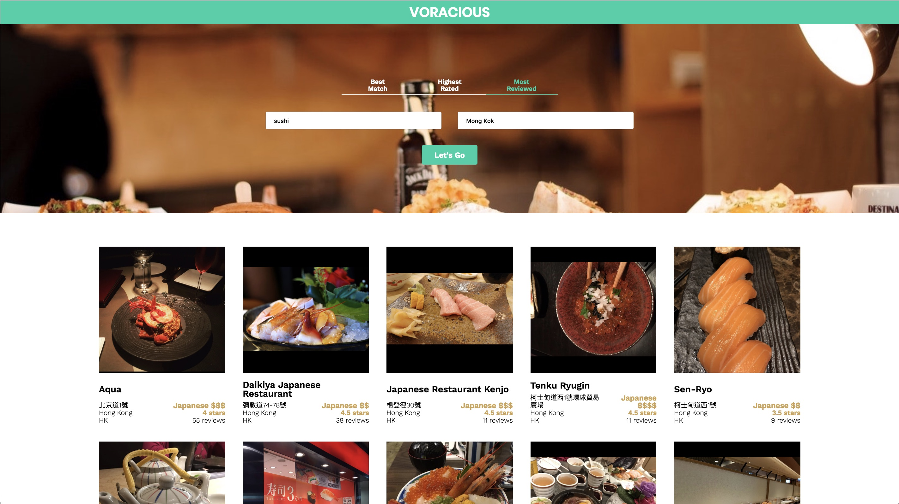

## Voracious

Whenever you are hungry, [Voracious](https://voracious.surge.sh) helps you search for nearby restaurants base on 
type of food and location!

You can search by Best Match, Highest Rated, or Most Reviewed.

Voracious makes use of the [Yelp API](https://www.yelp.com/developers/documentation/v3/business_search). Clicking on images of
the search results will direct you to the corresponding restaurants' Yelp page, providing further information about that 
particular eatery.

A live demo is available on [https://voracious.surge.sh](https://voracious.surge.sh), with SSL enabled.

### Source Code

All source code is provided except the Yelp API key at [src/util/Yelp.js](src/util/Yelp.js). You should register your own 
API key at [this link](www.yelp.com/developers/v3/manage_app).

To run this application on your local machine, follow these steps:

1. `git clone` this directory to your local machine.
2. [install nodejs](https://nodejs.org/) on your machine.
3. `sudo npm install -g create-react-app` to install reactjs.
4. `cd` to this project directory, `npm install` to install all required dependencies.
5. `npm start` to host the app on your local machine. A webpage shall pop out. If not, nevigate to `http://localhost:3000/`
in your browser.
6. To compile a production build of the project, type `npm run build` in the project directory. The production build shall be
created in the `build` directory.
7. Deploy your app on [surge](https://surge.sh/), which is [as simple as](https://daveceddia.com/deploy-create-react-app-surge/):
   1. `sudo npm install -g surge`
   2. `cd` to your `build` directory
   3. `surge`
